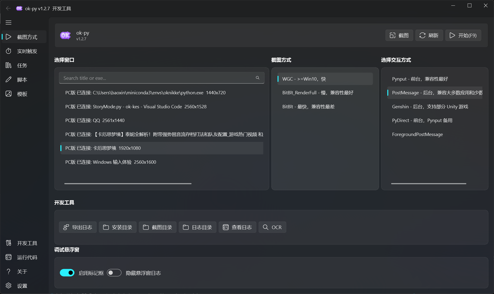

<div align="center">
  <h1 align="center">
    
    <br/>
    ok-kes
  </h1> 
  
  <p>
    An image-recognition-based automation tool for Chaos Zero Nightmare (卡厄思梦境), with background mode support, developed with <a href="https://github.com/ok-oldking/ok-script">ok-script</a>.
  </p>
  
  <p><i>Operates by simulating the Windows user interface, with no memory reading or file modification.</i></p>
</div>

<!-- Badges -->
<div align="center">
  

[](https://github.com/baoxin1100/ok-kes/releases)

</div>

English | [中文说明](README.md)

> 📖 **New user? Start with the [Complete Usage Guide (Chinese)](docs/zh-CN/usage-guide.md).**

---

## ⚠️ Disclaimer

This software is an external auxiliary tool designed to automate parts of the gameplay for Chaos Zero Nightmare (卡厄思梦境). It interacts with the game solely by simulating standard user interface actions, in compliance with relevant laws and regulations. This project aims to simplify repetitive user tasks and does not disrupt game balance or provide an unfair advantage. It will never modify any game files or data.

This software is open-source and free, intended for personal learning and communication purposes only. Do not use it for any commercial or profit-making activities. The development team reserves the right of final interpretation. Any issues arising from the use of this software are not the responsibility of this project or its developers.

**By using this software, you acknowledge that you have read, understood, and agreed to the above statement, and you voluntarily assume all potential risks.**

## 🚀 Quick Start

1. **Download the Installer**: Go to [GitHub Releases](https://github.com/baoxin1100/ok-kes/releases) and download the latest installer.
2. **Install and Run**: Install the program. It updates automatically after launch; start the game, connect its window, and select a feature to run.

## ✨ Main Features



### Sortie Mode (Auto Battle)
- 🎮 **Auto Battle**: Intelligent card play based on key recognition, with customizable play priority
- 🃏 **Auto Card Management**: Auto obtain, remove, copy, and flash cards
- ⚔️ **Member Selection**: Auto select battle members based on priority configuration
- 🛣️ **Route Selection**: Intelligent node type recognition, auto advance by priority
- 🏪 **Shop Handling**: Auto enter Derang Shop to remove cards
- 💊 **Ether Supply Detection**: Detect low stamina and exit automatically
- Fully customizable card priorities, remove/copy/flash lists, etc.

### Chaos Mode (卡厄思模式)
- 🃏 **Auto Card Management**: Remove, copy, flash, grant flash, convert cards
- 🛣️ **Route Selection**: Auto identify rest/event/boss/normal enemy nodes
- 🏥 **Mental Breakdown Treatment**: Auto visit trauma center for treatment
- 📦 **Save Data Handling**: Auto delete save data (configurable retention)
- 🏪 **Shop Handling**: Auto enter Derang Shop
- 🌀 **Zero System Support**: Auto handle Codex search
- More features under development...

### Story Mode (Semi-Auto)
- 💬 **Auto Dialogue**: Skip story dialogues automatically
- ⚠️ **Manual Mode Switching**: Switch to Sortie/Chaos mode when encountering battles or chaos stages

### Config Export & Import
- 📤 **Export Config**: One-click encode your current mode configuration as text and copy to clipboard for sharing
- 📥 **Import Config**: Paste a shared configuration code to apply it, compatible across different versions

### Config Sync & Hot Configs (v1.3.5+)
- 📡 **Auto Upload Config**: Automatically uploads anonymous config info and win rates to the cloud every 5 minutes to help compile popular configurations
- 🌟 **Hot Configs**: Click "Hot Configs" button in Chaos/Sortie Mode config pages
  - Browse high-win-rate configurations shared by other players (sortable by win rate or user count)
  - One-click apply a hot config to your local setup
  - Requires config upload to be enabled (prevents downloading without contributing)
- 🔒 **Privacy**: Uploads no personal info, game accounts, screenshots, or IP addresses

### General Features
- 🖥️ **High-Resolution Support**: Supports 1920x1080 / 1600x900 / 1280x720 and other 16:9 resolutions
- 🔄 **Background Mode**: Supports running in the background while the game window is minimized or obscured
- 🌏 **Client Support**: Supports Simplified Chinese and Traditional Chinese game clients, including Android emulators (set "Game Language" in each automation mode)

## 🔧 Usage Guide

1. **International Server Players**: Set "Game Language" to "繁体中文" (Traditional Chinese) in the automation mode you use
2. **Auto Battle**: Depends on keybind recognition; enable shortcut key display in game settings for better accuracy
3. **Chaos Mode**: Enable auto-battle and auto-story features within the game
4. **Story Mode**: Manually enable Sortie Mode for battle stages; manually enable Chaos Mode for chaos stages; battle stage teams must be configured manually

## 🔧 Troubleshooting

If you encounter issues, please check the following steps one by one before asking for help:

1. **Antivirus Software**: Add the software's installation directory to the **exceptions or whitelist** of your antivirus software (including Windows Defender) to prevent files from being mistakenly deleted or blocked.
2. **Display Settings**:
   * Turn off all graphics card filters (like NVIDIA Game Filter) and sharpening features.
   * Use the game's default brightness settings.
   * Disable any overlays that display information on the game screen.
3. **Game Resolution**: Ensure the game resolution is set to a 16:9 aspect ratio.
4. **Software Version**: Check and ensure you are using the latest version.
5. **Getting Help**: If the steps above do not solve your problem, please submit a detailed bug report through our community channels.

---

## 💻 Developer Zone

### Running from Source (Python)

```bash
# Install or update dependencies
pip install -r requirements.txt --upgrade

# Run Release version
python main.py

# Run Debug version
python main_debug.py
```

## 💬 Join Us

- **QQ Group**: `1040800032` (Join answer: `烟火焚`)
- **QQ Channel**: [Click to join](https://pd.qq.com/s/eopggnxcu)

This project is developed based on the [ok-script](https://github.com/ok-oldking/ok-script) framework. It is simple and easy to maintain. Developers interested in creating their own automation projects are welcome to use [ok-script](https://github.com/ok-oldking/ok-script).

## 🔗 Projects using ok-script:

* Chaos Zero Nightmare: [https://github.com/baoxin1100/ok-kes](https://github.com/baoxin1100/ok-kes)
* Wuthering Waves: [https://github.com/ok-oldking/ok-wuthering-waves](https://github.com/ok-oldking/ok-wuthering-waves)
* Girls' Frontline 2: [https://github.com/ok-oldking/ok-gf2](https://github.com/ok-oldking/ok-gf2)
* Starsee: [https://github.com/Sanheiii/ok-star-resonance](https://github.com/Sanheiii/ok-star-resonance)
* Duet Night Abyss: [https://github.com/BnanZ0/ok-duet-night-abyss](https://github.com/BnanZ0/ok-duet-night-abyss)
* Arknights: Endfield: [https://github.com/AliceJump/ok-end-field](https://github.com/AliceJump/ok-end-field)
* Neverness to Everness: [https://github.com/BnanZ0/ok-nte](https://github.com/BnanZ0/ok-nte)
* Onmyoji: [https://ok-script.com/ok-onmyoji](https://ok-script.com/ok-onmyoji)

## ❤️ Credits

* [ok-script](https://github.com/ok-oldking/ok-script)
* [OnnxOCR](https://github.com/ok-oldking/OnnxOCR)
* [PyQt-Fluent-Widgets](https://github.com/zhiyiYo/PyQt-Fluent-Widgets)
